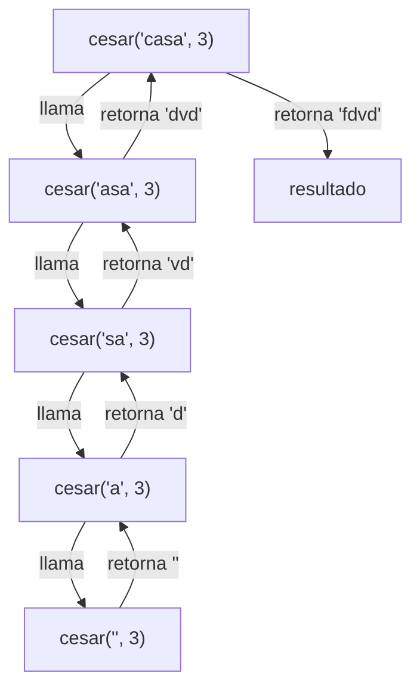
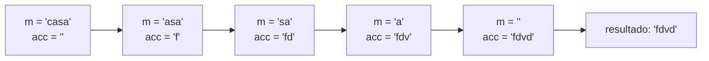

# Informe de proceso: puntos 1 y 2 (cifrado César)

Este informe explica cómo se ejecutan `cesar` (recursión lineal) y `cesarCola` (recursión de cola), mostrando el estado de la pila de llamados en cada paso para el ejemplo `cesar("casa", 3)` y `cesarCola("casa", 3)`.

## 1. Función auxiliar `desplazar`

Ambas funciones usan la misma auxiliar, definida dentro de cada una:

```scala
def desplazar(c: Char): Char =
  if (c >= 'a' && c <= 'z') ((((c - 'a' + k) % 26) + 26) % 26 + 'a').toChar
  else c
```

Si `c` es una letra minúscula, calcula su posición $p = c - \texttt{'a'}$, le suma $k$ y reduce módulo 26. Si no lo es, devuelve el mismo carácter.

El doble módulo `((x % 26) + 26) % 26` es necesario porque `%` en Scala conserva el signo del dividendo. Por ejemplo, para `'a'` con $k = -1$:

| Paso | Valor |
|---|---|
| $p + k$ | $0 + (-1) = -1$ |
| `-1 % 26` | $-1$ |
| `-1 + 26` | $25$ |
| `25 % 26` | $25$ |
| Letra resultante | `'z'` |

Para el ejemplo del informe, con $k = 3$:

| Letra | Posición $p$ | $(p + 3) \bmod 26$ | Resultado |
|---|---|---|---|
| `c` | 2 | 5 | `f` |
| `a` | 0 | 3 | `d` |
| `s` | 18 | 21 | `v` |
| `a` | 0 | 3 | `d` |

## 2. Punto 1: `cesar` (recursión lineal)

```scala
def cesar(m: Mensaje, k: Int): Mensaje = {
  def desplazar(c: Char): Char = ...   // ver sección 1

  if (m.isEmpty) ""
  else desplazar(m.head).toString + cesar(m.tail, k)
}
```

- **Caso base:** si el mensaje es vacío, el resultado es `""`.
- **Caso recursivo:** se cifra la primera letra y se concatena con el resultado de cifrar el resto.

La clave está en la concatenación `+`: **se ejecuta después** de que vuelve la llamada recursiva. Mientras esa llamada no termine, la operación queda pendiente y su marco debe seguir en la pila.

### 2.1. Traza de la evaluación

```
cesar("casa", 3)
= "f" + cesar("asa", 3)
= "f" + ("d" + cesar("sa", 3))
= "f" + ("d" + ("v" + cesar("a", 3)))
= "f" + ("d" + ("v" + ("d" + cesar("", 3))))
= "f" + ("d" + ("v" + ("d" + "")))
= "f" + ("d" + ("v" + "d"))
= "f" + ("d" + "vd")
= "f" + "dvd"
= "fdvd"
```

### 2.2. Estado de la pila paso a paso

Cada línea muestra la pila de abajo hacia arriba; el último marco es el que se está ejecutando.

**Fase de ida (la pila crece):**

| Paso | Pila de llamados | Operación pendiente al final |
|---|---|---|
| 1 | `cesar("casa")` | |
| 2 | `cesar("casa")` → `cesar("asa")` | `"f" + _` |
| 3 | `cesar("casa")` → `cesar("asa")` → `cesar("sa")` | `"d" + _` |
| 4 | `cesar("casa")` → `cesar("asa")` → `cesar("sa")` → `cesar("a")` | `"v" + _` |
| 5 | `cesar("casa")` → `cesar("asa")` → `cesar("sa")` → `cesar("a")` → `cesar("")` | `"d" + _` |

En el paso 5 se llega al caso base y la pila alcanza su altura máxima: **5 marcos** (para un mensaje de longitud $n$, son $n + 1$).

**Fase de vuelta (la pila se desarma resolviendo lo pendiente):**

| Paso | Marco que retorna | Valor devuelto | Pila que queda |
|---|---|---|---|
| 6 | `cesar("")` | `""` | 4 marcos |
| 7 | `cesar("a")` | `"d" + ""` = `"d"` | 3 marcos |
| 8 | `cesar("sa")` | `"v" + "d"` = `"vd"` | 2 marcos |
| 9 | `cesar("asa")` | `"d" + "vd"` = `"dvd"` | 1 marco |
| 10 | `cesar("casa")` | `"f" + "dvd"` = `"fdvd"` | vacía |



### 2.3. ¿Por qué la pila crece?

Porque la llamada recursiva **no es lo último** que hace la función: tras ella aún falta concatenar. Cada marco debe guardar su letra ya cifrada hasta que el resto del mensaje termine de procesarse. Resultado: uso de pila proporcional a la longitud del mensaje, $O(n)$. Con mensajes muy largos esto puede producir un `StackOverflowError`.

## 3. Punto 2: `cesarCola` (recursión de cola)

```scala
@tailrec
final def cesarCola(m: Mensaje, k: Int, acc: Mensaje = ""): Mensaje = {
  def desplazar(c: Char): Char = ...   // ver sección 1

  if (m.isEmpty) acc
  else cesarCola(m.tail, k, acc + desplazar(m.head))
}
```

- **Caso base:** si el mensaje es vacío, el resultado es el acumulador.
- **Caso recursivo:** se cifra la primera letra, se agrega al final del acumulador y se llama con el resto del mensaje.

Aquí la llamada recursiva **es lo último** que se ejecuta: no queda ninguna operación pendiente. El resultado parcial no se guarda en la pila sino que viaja como argumento en `acc`.

### 3.1. Traza de la evaluación

```
cesarCola("casa", 3, "")
→ cesarCola("asa", 3, "f")
→ cesarCola("sa",  3, "fd")
→ cesarCola("a",   3, "fdv")
→ cesarCola("",    3, "fdvd")
= "fdvd"
```

### 3.2. Estado de la pila paso a paso

| Paso | `m` | `acc` | Pila de llamados |
|---|---|---|---|
| 1 | `"casa"` | `""` | 1 marco |
| 2 | `"asa"` | `"f"` | 1 marco (reutilizado) |
| 3 | `"sa"` | `"fd"` | 1 marco (reutilizado) |
| 4 | `"a"` | `"fdv"` | 1 marco (reutilizado) |
| 5 | `""` | `"fdvd"` | 1 marco: caso base, devuelve `acc` |



### 3.3. ¿Por qué la pila no crece?

Como la llamada recursiva está en posición de cola, el compilador, gracias a `@tailrec`, la transforma en un salto: reutiliza el mismo marco actualizando los valores de `m` y `acc`. Si la llamada **no** estuviera en posición de cola, `@tailrec` produciría un error de compilación. Por eso el proceso corre en espacio de pila constante, $O(1)$, sin importar la longitud del mensaje.

## 4. Comparación

| Aspecto | `cesar` | `cesarCola` |
|---|---|---|
| Tipo de proceso | Recursivo lineal | Iterativo (recursión de cola) |
| Dónde queda el resultado parcial | En las operaciones pendientes de la pila | En el acumulador `acc` |
| Marcos de pila para $n$ letras | $n + 1$ | 1 |
| Espacio de pila | $O(n)$ | $O(1)$ |
| Riesgo con mensajes muy largos | `StackOverflowError` | Ninguno por pila |
| Cantidad de llamadas | $n + 1$ | $n + 1$ |

Ambas hacen exactamente la misma cantidad de llamadas; lo que cambia es **cuántas están vivas a la vez** en la pila.
