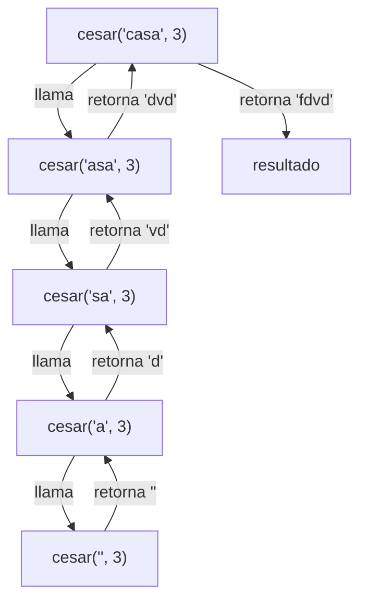
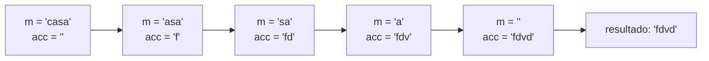
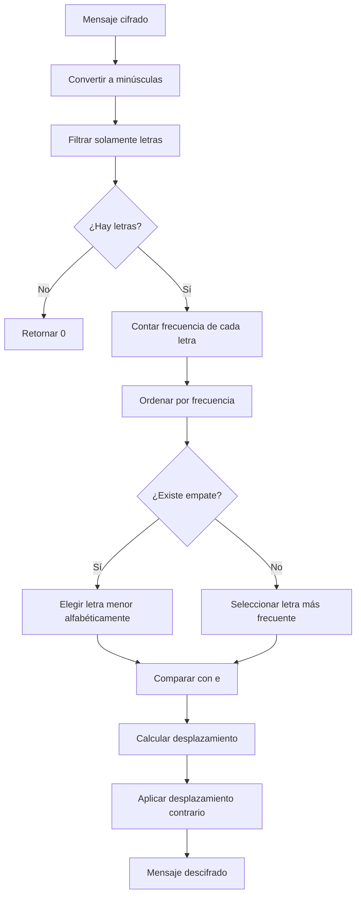
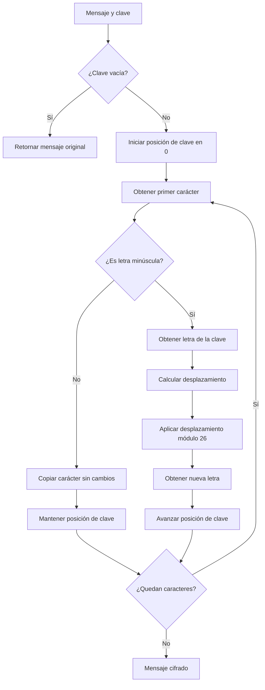
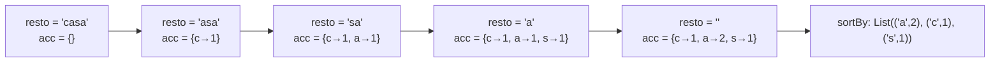

# Informe de proceso: puntos 1 y 2 (cifrado César)

Este informe explica cómo se ejecutan `cesar` (recursión lineal) y `cesarCola` (recursión de cola), mostrando el estado de la pila de llamados en cada paso para el ejemplo `cesar("casa", 3)` y `cesarCola("casa", 3)`.

## 1. Función auxiliar `desplazar`

Ambas funciones usan la misma auxiliar, definida dentro de cada una:

```scala
def desplazar(c: Char): Char =
  if (c >= 'a' && c <= 'z') ((((c - 'a' + k) % 26) + 26) % 26 + 'a').toChar
  else c
```

Si `c` es una letra minúscula, calcula su posición $p = c - \texttt{'a'}$, le suma $k$ y reduce módulo 26. Si no lo es, devuelve el mismo carácter.

El doble módulo `((x % 26) + 26) % 26` es necesario porque `%` en Scala conserva el signo del dividendo. Por ejemplo, para `'a'` con $k = -1$:

| Paso | Valor |
|---|---|
| $p + k$ | $0 + (-1) = -1$ |
| `-1 % 26` | $-1$ |
| `-1 + 26` | $25$ |
| `25 % 26` | $25$ |
| Letra resultante | `'z'` |

Para el ejemplo del informe, con $k = 3$:

| Letra | Posición $p$ | $(p + 3) \bmod 26$ | Resultado |
|---|---|---|---|
| `c` | 2 | 5 | `f` |
| `a` | 0 | 3 | `d` |
| `s` | 18 | 21 | `v` |
| `a` | 0 | 3 | `d` |

## 2. Punto 1: `cesar` (recursión lineal)

```scala
def cesar(m: Mensaje, k: Int): Mensaje = {
  def desplazar(c: Char): Char = ...   // ver sección 1

  if (m.isEmpty) ""
  else desplazar(m.head).toString + cesar(m.tail, k)
}
```

- **Caso base:** si el mensaje es vacío, el resultado es `""`.
- **Caso recursivo:** se cifra la primera letra y se concatena con el resultado de cifrar el resto.

La clave está en la concatenación `+`: **se ejecuta después** de que vuelve la llamada recursiva. Mientras esa llamada no termine, la operación queda pendiente y su marco debe seguir en la pila.

### 2.1. Traza de la evaluación

```
cesar("casa", 3)
= "f" + cesar("asa", 3)
= "f" + ("d" + cesar("sa", 3))
= "f" + ("d" + ("v" + cesar("a", 3)))
= "f" + ("d" + ("v" + ("d" + cesar("", 3))))
= "f" + ("d" + ("v" + ("d" + "")))
= "f" + ("d" + ("v" + "d"))
= "f" + ("d" + "vd")
= "f" + "dvd"
= "fdvd"
```

### 2.2. Estado de la pila paso a paso

Cada línea muestra la pila de abajo hacia arriba; el último marco es el que se está ejecutando.

**Fase de ida (la pila crece):**

| Paso | Pila de llamados | Operación pendiente al final |
|---|---|---|
| 1 | `cesar("casa")` | |
| 2 | `cesar("casa")` → `cesar("asa")` | `"f" + _` |
| 3 | `cesar("casa")` → `cesar("asa")` → `cesar("sa")` | `"d" + _` |
| 4 | `cesar("casa")` → `cesar("asa")` → `cesar("sa")` → `cesar("a")` | `"v" + _` |
| 5 | `cesar("casa")` → `cesar("asa")` → `cesar("sa")` → `cesar("a")` → `cesar("")` | `"d" + _` |

En el paso 5 se llega al caso base y la pila alcanza su altura máxima: **5 marcos** (para un mensaje de longitud $n$, son $n + 1$).

**Fase de vuelta (la pila se desarma resolviendo lo pendiente):**

| Paso | Marco que retorna | Valor devuelto | Pila que queda |
|---|---|---|---|
| 6 | `cesar("")` | `""` | 4 marcos |
| 7 | `cesar("a")` | `"d" + ""` = `"d"` | 3 marcos |
| 8 | `cesar("sa")` | `"v" + "d"` = `"vd"` | 2 marcos |
| 9 | `cesar("asa")` | `"d" + "vd"` = `"dvd"` | 1 marco |
| 10 | `cesar("casa")` | `"f" + "dvd"` = `"fdvd"` | vacía |



### 2.3. ¿Por qué la pila crece?

Porque la llamada recursiva **no es lo último** que hace la función: tras ella aún falta concatenar. Cada marco debe guardar su letra ya cifrada hasta que el resto del mensaje termine de procesarse. Resultado: uso de pila proporcional a la longitud del mensaje, $O(n)$. Con mensajes muy largos esto puede producir un `StackOverflowError`.

## 3. Punto 2: `cesarCola` (recursión de cola)

```scala
@tailrec
final def cesarCola(m: Mensaje, k: Int, acc: Mensaje = ""): Mensaje = {
  def desplazar(c: Char): Char = ...   // ver sección 1

  if (m.isEmpty) acc
  else cesarCola(m.tail, k, acc + desplazar(m.head))
}
```

- **Caso base:** si el mensaje es vacío, el resultado es el acumulador.
- **Caso recursivo:** se cifra la primera letra, se agrega al final del acumulador y se llama con el resto del mensaje.

Aquí la llamada recursiva **es lo último** que se ejecuta: no queda ninguna operación pendiente. El resultado parcial no se guarda en la pila sino que viaja como argumento en `acc`.

### 3.1. Traza de la evaluación

```
cesarCola("casa", 3, "")
→ cesarCola("asa", 3, "f")
→ cesarCola("sa",  3, "fd")
→ cesarCola("a",   3, "fdv")
→ cesarCola("",    3, "fdvd")
= "fdvd"
```

### 3.2. Estado de la pila paso a paso

| Paso | `m` | `acc` | Pila de llamados |
|---|---|---|---|
| 1 | `"casa"` | `""` | 1 marco |
| 2 | `"asa"` | `"f"` | 1 marco (reutilizado) |
| 3 | `"sa"` | `"fd"` | 1 marco (reutilizado) |
| 4 | `"a"` | `"fdv"` | 1 marco (reutilizado) |
| 5 | `""` | `"fdvd"` | 1 marco: caso base, devuelve `acc` |



### 3.3. ¿Por qué la pila no crece?

Como la llamada recursiva está en posición de cola, el compilador, gracias a `@tailrec`, la transforma en un salto: reutiliza el mismo marco actualizando los valores de `m` y `acc`. Si la llamada **no** estuviera en posición de cola, `@tailrec` produciría un error de compilación. Por eso el proceso corre en espacio de pila constante, $O(1)$, sin importar la longitud del mensaje.

## 4. Comparación

| Aspecto | `cesar` | `cesarCola` |
|---|---|---|
| Tipo de proceso | Recursivo lineal | Iterativo (recursión de cola) |
| Dónde queda el resultado parcial | En las operaciones pendientes de la pila | En el acumulador `acc` |
| Marcos de pila para $n$ letras | $n + 1$ | 1 |
| Espacio de pila | $O(n)$ | $O(1)$ |
| Riesgo con mensajes muy largos | `StackOverflowError` | Ninguno por pila |
| Cantidad de llamadas | $n + 1$ | $n + 1$ |

Ambas hacen exactamente la misma cantidad de llamadas; lo que cambia es **cuántas están vivas a la vez** en la pila.

# Informe de proceso: puntos 4 (romper un cesar por analisis de frecuencias)

El objetivo de este punto es romper un cifrado `cesar` utilizando el analisis de frecuencias de las letras usando `desplazamientoProbable(hhhaa)`

## 1. Implementacion de desplazamientoProbable

Se usa la funcion para obtener unicamente las letras del mensaje convirtiendolas en minuscula y asi evitar errores.

```Scala
def desplazamientoProbable(m: Mensaje): Int = {
val alfabeto = "abcdefghijklmnopqrstuvwxyz"
val letras = m.toLowerCase.filter(_.isLetter)

if (letras.isEmpty) {
      0
    } else {
      val conteos = frecuencias.map(letra => (letra, letras.count(_ == letra)))
      val letraMasFrecuente = conteos.maxBy{
        case (letra, cantidad) => (cantidad, -letra)
      }._1
      (letraMasFrecuente - 'e' + 26) % 26
    }
  }

  def romperCesar(m: Mensaje): Mensaje = {
    val desplazamiento = desplazamientoProbable(m)

    cesar(m, -desplazamiento)
  }
```
_ **Caso base:** Si el mensaje no tiene ninguna letra entonces el resultado es cero
_ **Caso de frecuencias:** Ya cuando se filtra las letras, se procede a contar cuantas veces aparece cada letra del alfabeto. Por ejemplo, para hhhaa se obtiene:
(a, 2)
(h, 3)
De aqui se permite determinal cual es la letra que tiene mayor frecuencia.
Luego se ordena las letras segun su frecuencia se utiliza `-cantidad` para ordenar las frecuencias de mayor a menor, tambien se incluyo la letra como segundo criterio de ordenamiento, asi cuando dos letras tiene la misma frecuencia, se selecciona la que aparece primero alfabeticamente

## 2. Notacion matematica usada

Cifrado César:
$$C(x) = (x+k)\mod 26$$
Descifrado:
$$D(x) = (x-k)\mod 26$$
Rango del desplazamiento:
$$0 \leq k < 26$$
Cálculo para h:
$$h-e = 7-4 = 3$$
Cálculo para a:
$$(-4+26)\mod26=22$$

## 3. Diagrama del proceso



## Informe de proceso: puntos 5 (combinaciones y cifrado Vigenère)

El objetivo de este punto es implementar dos funciones: combinaciones y vigenere.

La primera función permite calcular cuántos mensajes de longitud $n$ pueden formarse utilizando $a$ letras sin que aparezcan dos letras iguales seguidas.

La segunda función implementa el cifrado Vigenère, donde cada letra del mensaje se desplaza según la letra correspondiente de una clave.

## 1. Implementación de combinaciones

Se utiliza la función combinaciones para calcular la cantidad de mensajes de longitud $n$ que se pueden formar con $a$ letras sin tener dos letras iguales consecutivas.

def combinaciones(n: Int, a: Int): BigInt = {
if (n == 0){
BigInt(1)
} else if (n == 1){
BigInt(a)
} else {
BigInt(a - 1) * combinaciones(n - 1, a)
}
}
Caso base: Si $n=0$, solamente existe una cadena posible: la cadena vacía. Por esto el resultado es:

$$
1
$$

Caso base: Si $n=1$, existen $a$ posibilidades, porque se puede escoger cualquiera de las $a$ letras:

$$
a
$$

Caso recursivo: Para una cadena de longitud mayor que $1$, después de elegir una primera letra, cada nueva posición tiene $a-1$ posibilidades, porque no puede utilizar la misma letra que está inmediatamente antes.

Por esto se utiliza:

$$
(a-1)\cdot \operatorname{combinaciones}(n-1,a)
$$

De esta manera se va reduciendo $n$ hasta llegar a uno de los casos base.


## 2. Implementación de Vigenère

La función vigenere implementa el cifrado utilizando una clave.

def vigenere(m: Mensaje, clave: Clave): Mensaje = {

def cifrar(mensaje: String, posicionClave: Int): String = {
if (mensaje.isEmpty) {
""
} else {
val caracter = mensaje.head

      if (caracter >= 'a' && caracter <= 'z') {
        val letraClave = clave(posicionClave % clave.length)
        val desplazamiento = letraClave - 'a'
        val nuevaLetra = ((caracter - 'a' + desplazamiento) % 26 + 'a').toChar

        nuevaLetra.toString + cifrar(mensaje.tail, posicionClave + 1)
      } else {
        caracter.toString + cifrar(mensaje.tail, posicionClave)
      }
    }
}

if (clave.isEmpty) {
m
} else {
cifrar(m, 0)
}
}

El funcionamiento de la función consiste en recorrer el mensaje carácter por carácter.

Si el carácter es una letra minúscula, se toma la letra correspondiente de la clave y se utiliza como desplazamiento.

Si el carácter no es una letra minúscula, se copia sin modificar y no se avanza la posición de la clave.

## 3. Procedimiento del cifrado Vigenère

Primero se comprueba si la clave está vacía:

if (clave.isEmpty) {
m
}

Si la clave no tiene ninguna letra, el mensaje se devuelve sin modificaciones.

Si la clave contiene letras, se comienza a procesar el mensaje desde la posición $0$:

cifrar(m, 0)

Dentro de cifrar, primero se obtiene el primer carácter:

val caracter = mensaje.head

Después se comprueba si pertenece al rango de letras minúsculas:

if (caracter >= 'a' && caracter <= 'z')

Si es una letra, se obtiene la letra correspondiente de la clave mediante:

val letraClave = clave(posicionClave % clave.length)

El operador % permite repetir la clave cuando se llega a su final.


## 5. Diagrama del proceso

## 5. Punto 3: `frecuencias` (recursión de cola)

```scala
def frecuencias(m: Mensaje): Frecuencias = {
  @tailrec
  def contar(resto: Mensaje, acc: Map[Char, Int]): Map[Char, Int] =
    if (resto.isEmpty) acc
    else if (esMinuscula(resto.head))
      contar(resto.tail, acc.updated(resto.head, acc.getOrElse(resto.head, 0) + 1))
    else contar(resto.tail, acc)

  contar(m, Map.empty[Char, Int]).toList.sortBy(p => (-p._2, p._1))
}
```

- **Caso base:** si `resto` es vacío, el resultado es el acumulador `acc`.
- **Caso recursivo:** si la primera letra es minúscula, se suma 1 a su cuenta en `acc`; si no, `acc` queda igual. En ambos casos se llama con `resto.tail`.
- **Ordenamiento final:** se hace una sola vez, después del recorrido, con `sortBy`.

### 5.1. Traza de la evaluación para `frecuencias("casa")`

```
contar("casa", {})
→ contar("asa", {c→1})
→ contar("sa",  {c→1, a→1})
→ contar("a",   {c→1, a→1, s→1})
→ contar("",    {c→1, a→2, s→1})
= {c→1, a→2, s→1}
→ toList.sortBy(...) = List(('a',2), ('c',1), ('s',1))
```

### 5.2. Estado de la pila paso a paso

| Paso | `resto` | `acc` | Pila de llamados |
|---|---|---|---|
| 1 | `"casa"` | `{}` | 1 marco |
| 2 | `"asa"` | `{c→1}` | 1 marco (reutilizado) |
| 3 | `"sa"` | `{c→1, a→1}` | 1 marco (reutilizado) |
| 4 | `"a"` | `{c→1, a→1, s→1}` | 1 marco (reutilizado) |
| 5 | `""` | `{c→1, a→2, s→1}` | 1 marco: caso base, devuelve `acc` |



### 5.3. ¿Por qué la pila no crece?

La llamada a `contar` es la última operación de cada rama: la actualización del `Map` se calcula antes, como argumento. No queda nada pendiente, así que el compilador, gracias a `@tailrec`, reutiliza el mismo marco y el espacio de pila es $O(1)$. El conteo parcial viaja en `acc`, no en la pila. El ordenamiento ocurre una sola vez al final y no genera llamados pendientes.
